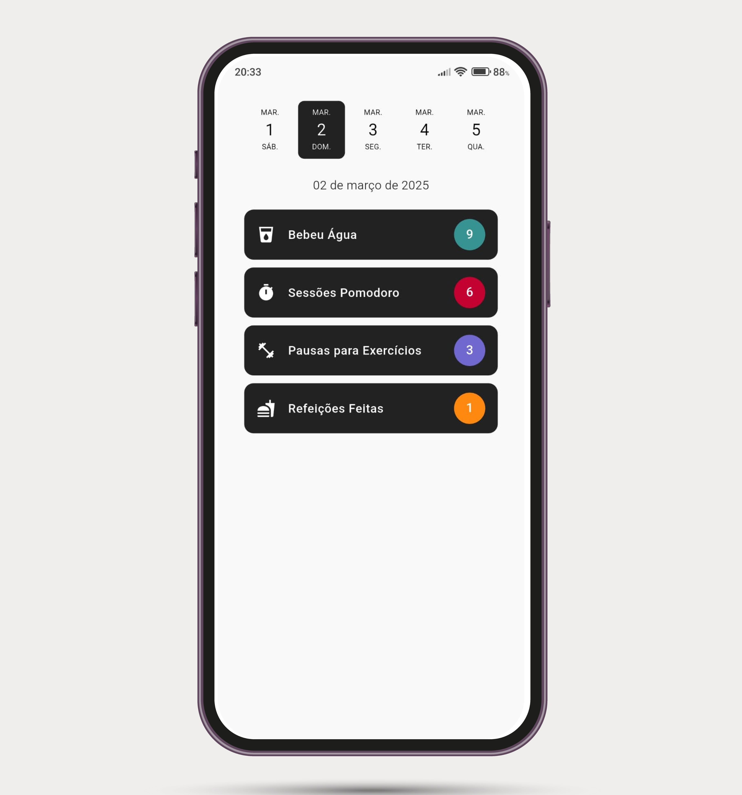
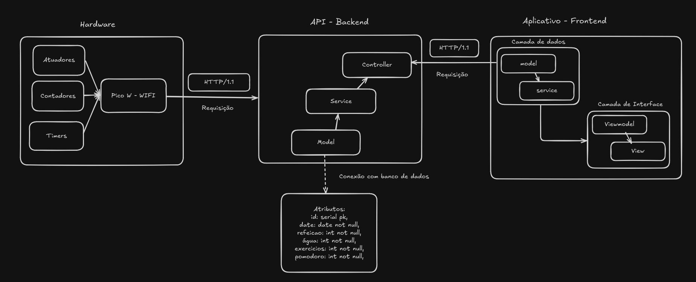

# Habit Tracker - Raspberry Pi Pico W

# Descrição

Este projeto é um sistema embarcado para rastreamento de hábitos, desenvolvido no Raspberry Pi Pico W. Ele visa auxiliar pessoas que trabalham ou estudam na frente do computador, monitorando tempo de foco, pausas e outros aspectos relacionados à saúde e produtividade.

# Objetivo

O objetivo é proporcionar uma solução que permita o rastreamento de hábitos essenciais de forma independente de dispositivos móveis, facilitando a adoção de comportamentos mais saudáveis e produtivos. A proposta visa estimular o uso contı́nuo do sistema, utilizando feedbacks visuais e sonoros que incentivem o usuário a manter o foco nas suas rotinas diárias, criando uma experiência envolvente e motivadora. Além
disso, busca-se garantir que o sistema contribua para um aumento real na produtividade, proporcionando uma maneira prática e eficiente de gerenciar o tempo e as atividades.

# Aplicativo

Para facilitar o monitoramento e proporcionar uma visão completa dos hábitos, foi desenvolvido um aplicativo minimalista para isso. Nele, o usuário pode acompanhar todas as informações sobre seus hábitos ao longo do dia de forma prática e organizada.

# Arquitura de Comunicação

A arquitetura do projeto é dividida em três partes principais: Hardware, Backend e Aplicativo (Frontend). O hardware, responsável pelo sistema de rastreamento de hábitos, envia dados via requisições HTTP. O backend segue a divisão em Controller, Service e Model, gerenciando as requisições, salvando e acessando o banco de dados. Por fim, o aplicativo, também organizado em camadas de dados e interface, exibe as informações ao usuário de forma prática.

## BitDogLab

Esse projeto foi construído na BitDogLab